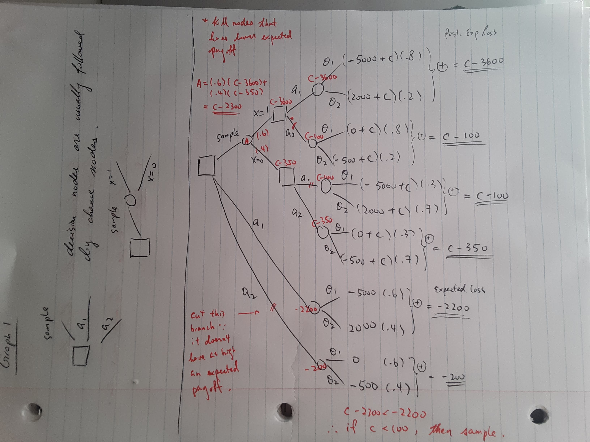
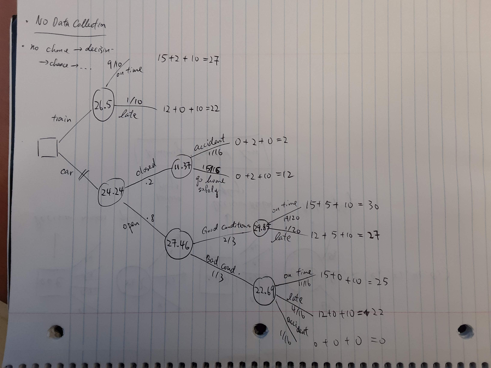
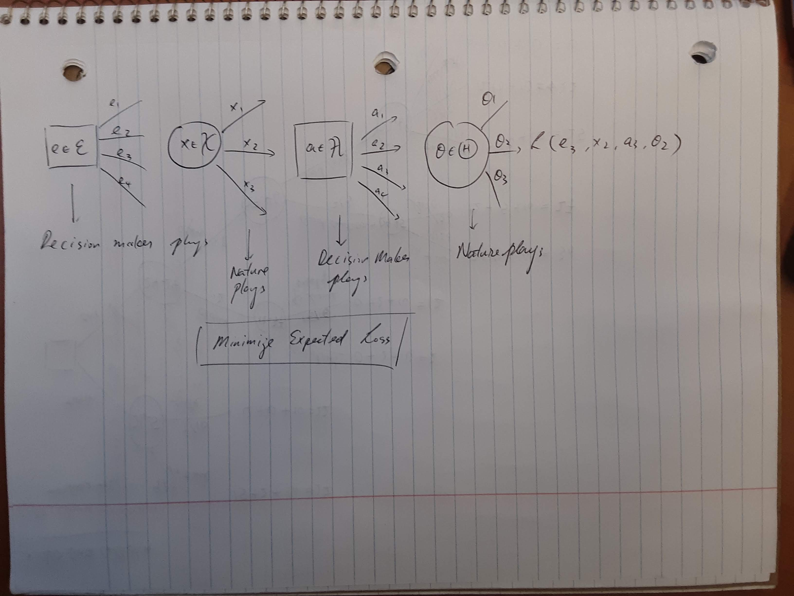

\newcommand{\norm}[1]{\left\lVert#1\right\rVert}
\newcommand{\p}[1]{\left(#1\right)}
\newcommand{\bk}[1]{\left[#1\right]}
\newcommand{\bc}[1]{ \left\{#1\right\} }
\newcommand{\abs}[1]{ \left|#1\right| }
\newcommand{\mat}{ \begin{pmatrix} }
\newcommand{\tam}{ \end{pmatrix} }
\newcommand{\suml}{ \sum_{i=1}^n }
\newcommand{\prodl}{ \prod_{i=1}^n }
\newcommand{\ds}{ \displaystyle }
\newcommand{\df}[2]{ \frac{d#1}{d#2} }
\newcommand{\ddf}[2]{ \frac{d^2#1}{d{#2}^2} }
\newcommand{\pd}[2]{ \frac{\partial#1}{\partial#2} }
\newcommand{\pdd}[2]{\frac{\partial^2#1}{\partial{#2}^2} }
\newcommand{\N}{ \mathcal{N} }
\newcommand{\E}{ \text{E} }
\newcommand{\A}{ \mathcal{A} }
\newcommand{\X}{ \mathcal{X} }
\newcommand{\tlt}{ \text{<} }
\newcommand{\tgt}{ \text{>} }
\newcommand{\lgp}[1]{ \tlt#1\tgt }

# Decision Trees

Decision trees provide a pictorial representation of a sequential decision
problem (dynamic programming).

Refer to oil drilling example (in `notes01`).

| $\theta$ \\ $x$ | 0 | 1 |
|---|---:|---:|
| $\theta_1$ | .2 | .8 |
| $\theta_2$ | .7 | .3 |
Table: $P(X\mid\theta)$

| $\theta$ | $\theta_1$ (oil) | $\theta_2$ (no oil) |
|---|---:|---:|
|  | .6 | .4 |
Table: $\pi(\theta)$

The outcome $X = \begin{cases}
\text{presence of a certain formation} \\
\text{absence of a certain formation} \\
\end{cases}$

| $\theta$ \\ $a$ | $a_1$ (Drill) | $a_2$ (Sell) |
|---|---:|---:|
| $\theta_1$ | $-5000$  | $0$ |
| $\theta_2$ |  $2000$  | $-500$  |
Table: Loss function $\mathcal{L}(\theta, a) = -U(\theta, a)$. $C > 0$ is a sampling cost.

A decision tree has two types of nodes.

- `o` chance nodes that depend on random events
- $\square$ decision nodes that depend on actions

You start the tree from the root that is placed at the left-hand side of the paper.
The decision maker has three choices to start with. 

1. drill
2. sell
3. take the sample

{ width=500px }

{ width=500px }

$$\begin{split}
\Pr(X=1)&=\Pr(X=1\mid\theta_1) \Pr(\theta_1) + \Pr(X=1\mid\theta_2) \Pr(\theta_2)= (.8)(.6) + (.3)(.4) = .6 \\
\Pr(X=0)&=\Pr(X=0\mid\theta_1) \Pr(\theta_1) + \Pr(X=0\mid\theta_2) \Pr(\theta_2)= .4 \\
\\
\Pr(\theta_1\mid X=1)&=\Pr(X=1\mid\theta_1) \Pr(\theta_1) / \Pr(X=1) = .8\\
\Pr(\theta_2\mid X=0)&=\Pr(X=0\mid\theta_2) \Pr(\theta_2) / \Pr(X=0) = .7\\
\end{split}$$

## Example 2
Traveller considers crossing a mountain pass in the winter. The traveller can
use a car or ride a train. There are uncertainties related to the state of the road
and the possibility of an accident.

The decisions are 

- $a_1$ go by car
- $a_2$ go by train

***

- If traveller takes the train, he will be either late or on time, but he will get there.
- If traveller goes by car, the pass can be open or closed.
    - If the pass is closed, he may return safely OR have an accident.
    - If the pass is open, conditions may be good or bad.
          - if the conditions are good, he may get to the appointment late or on time
          - if the conditions are bad, he needs to consider the chances of having an accident

### Probabilities

- $\Pr(\text{pass open}) = 4/5$
- $\Pr(\text{good conditions} \mid \text{pass open}) = 2/3$
- $\Pr(\text{late} \mid \text{good conditions}) = 1/20$
- $\Pr(\text{late} \mid \text{bad conditions}) = 1/4$
- $\Pr(\text{accident} \mid \text{bad conditions}) = 1/16$
- $\Pr(\text{accident} \mid \text{pass closed}) = 1/16$
- $\Pr(\text{train late}) = 1/10$

### Utilities (usually also Negative Losses)

We consider three aspects of the problem. Utilities in parenthesis. $U \ge 0$.

- Arrival Time
    - on time (+15)
    - late (+12)
    - no arrival (0)
- Journey Quality
    - good (+5)
    - indifferent (+2)
    - bad (0)
- Possibility of Accident
    - yes (0)
    - no (+10)

{ width=500px }

## Elements of a Decision Problem

- **state of nature**: $\theta \in \Theta$
- **actions**: $a \in \A$ (aka decisions)
- **Loss function**: $L(\theta, a)$ (negative utility)
- **Statistical evidence** $X \in \X$ (data)
- **Experiment**: $e \in \mathcal{E}$ ($n \in \mathbb{N}$)

The complete scheme looks like:

{ width=500px }

## Bets

$\theta$ is the indicator of an event. Fisher wins a tennis match against
Neyman. A bet is a ticket that will be worth $S$ (stakes) if $\theta$ occurs,
and 0 otherwise. The ticket costs $\pi_\theta S$.
$\frac{\pi_\theta}{1-\pi_\theta}$ are the betting odds in favor of $\theta$.
The payoffs for the action of buying a ticket are:

| $\theta$ | 0 | 1 |
|---|---:|---:|
| Buy bet on $\theta$ | $(1-\pi) S$ | $-\pi S$ |
| Sell bet on $\theta$ | -$(1-\pi) S$ | $\pi S$ |

## Dutch Book (Arbitrage)

Suppose a bookmaker posts the price $0.2$ for bets on the event "Fisher wins",
and the price $0.7$ for bets on "Neyman wins". Suppose you place both bets.

|  | Fisher wins | Neyman wins |
|---|---:|---:|
| Bet 1     | $0.85 S$ | $-0.25 S$ |
| Bet 2     | $-0.7 S$ | $0.3 S$   |
| Both bets | $0.1 S$  | $0.1 S$   |

You make $0.1 S$ **for sure** if you place both bets.

## Coherence

A set of betting odds is **coherent** if no combination of bets produces sure losses.

Assumptions:

1. The odds are fair. The bookmaker is willing to both sell and buy any bets.
2. There is no restriction in the number of bets that can be placed. And they
   are all equally valuable.

**Theorem**: Under assumptions 1 and 2 (above), a necessary condition for a set of prices to be coherent is that they satisfy Kolmogorov axioms.

- Axiom 1: $0 \le \pi_\theta \le 1, ~ \forall \theta$
- Axiom 2: $0 \pi_\Theta = 1$ where $\Theta$ is the sure event
- Axiom 3: If $\theta_!$ and $\theta_2$ are such that $\theta_1\theta_2 = 0$,
  then $\pi_{\theta_1} + \pi_{\theta_2} = \pi_{\theta_1 + \theta_2}$

**Proof**: See Parmigiani & Inoue p.19

## Coherent Conditional Probabilities

See Parmigiani & Inoue p.20 - 21

# Utility (Chapter 3)

- St. Peterburg Paradox
    - How do we value payoffs that are subject to uncertainty What is the fair
      price of a bet? The answer to that question is expected utility.
          - fair value `<->` expected utility

# Expected Utility Principle

See Parmigiani & Inoue p.40

- define a set of outcomes on rewards $Z$
- define a set of states of the world $\Theta$
- An action is a function mapping $\Theta$ to $Z$, $a: \Theta \rightarrow Z$
- $\A$ is the set of all possible actions
- we want to produce a function $U(z)$ that measures the utility of rewards $z$
- probabilities of states of the world $\theta$ are distributions $\pi(\theta)$

We can think of actions as probability distributions over rewards:
$$p(z) = \int_{\theta: a(\theta)=z} \pi(\theta) d\theta$$

The utility of an action is 
$$u_{\pi}(a) = \int_\Theta u(a(\theta)) \pi(\theta)d\theta$$

Assuming $z$ is finite,
$$u_{\pi}(a) = \sum_{z\in Z} p(z) u(z)$$

Our preferred action will be:
$$a^*=\text{argmax}_a\bc{u_\pi(a)}$$

Denote $\prec$ a binary preference that is such that $a \prec a'$ indicates that action
$a'$ is preferred to action a strictly. $a \sim a'$ indicates indifference.
$a\preceq a'$ indicates preferred or indifferent.

We need two assumptions: 

- completeness: for any two actions, $a, a' \in \A$, one and only one of the
  following holds:
    - $a \prec a'$ or $a \succ a'$ or $a \sim a'$. "I don't know" is not allowed.
- Transitivity: for any $a, a', a'' \in \A$ , $a\preceq a'$ and $a' \preceq a''$ implies
  $a \preceq a''$.

Notation: $a, a' \in \A, \alpha \in \bk{0,1}, \text{ then } a'' = \alpha a +
(1-\alpha) a'$, is the action that assigns probability $\alpha p(z) +
(1-\alpha)p'(z)$.

The Von-Neumann-Morgenstern theory requires the following conditions:

1. $\prec$ is complete and transitive
2. independence: $a, a', a'' \in \A$ and $\alpha \in \bk{0,1}$, $a \succ a'
   \Rightarrow (1-\alpha) a'' + \alpha a \succ (1-\alpha) a'' + \alpha a'$.
3. Archimedean: $a, a', a'' \in \A$. For $a\succ a' \succ a''$, there exists
  $\alpha, \beta \in(0,1)$ such that $\alpha a + (1-\alpha) a'' \succ a' \succ
  \beta a + (1-\beta)a''$

See Theorem 3.1 in Parmigiani & Inoue

The result indicates that our preferences for actions can be translated into an 
ordering of expected utilities.

How do we come up with such a function?

Denote $\tlt z \tgt$ the probability distribution that gives probability one to
reward $z$.

- step 1: choose two rewards that are NOT equivalent, say $z_1$ and $z_2$.
  Assume $\lgp{z_1} \prec \lgp{z_2}$. $u(z_1) = 0, u(z_2)=1$.
- step 2: For reward $z_3$ that is such that $\tlt z_1 \tgt \prec \tlt z_3 \tgt
  \prec \tlt z_2 \tgt$
      - Find $\alpha \in (0,1)$ such that $\tlt z_3 \tgt \approx \alpha \tlt z_1 \tgt + (1-\alpha) \lgp{z_2}$ then $u(z_3) = \alpha u(z_1) + (1-\alpha) u(z_2) = 1 - \alpha$.
- step 3: For a reward $\lgp{z_4}$ such that $\lgp{z_1} \succ \lgp{z_4}$. Find $\alpha$
  such that $$\lgp{z_1} \approx \alpha \lgp{z_4} + (1-\alpha) \lgp{z_2}$$
  $$0 = u(z_1) = \alpha(z_4) + (1-\alpha) \Rightarrow u(z_4) = - (1-\alpha) / \alpha$$
- step 4: $\lgp{z_2} \prec \lgp{z_5}$ ... $u(z_5) = 1 / (1-\alpha)$
- step 5: consistency check: Find $\alpha$ such that $\lgp{z_5} = \alpha{}$ ...

Example: Saturday afternoon you have the following choices. 

- $a_1$: go to a football game
- $a_2$: go to a movie

Your preference is for $a_1$ but the weather might be bad.

- $\theta_1$: bad weather. $\pi(\theta_1) = .4$.
- $\theta_2$: good weather. $\pi(\theta_2) = .6$.

You have four possible rewards. $z_1 = (a_1, \theta_1), z_2 = (a_1, \theta_2),
z_3 = (a_2, \theta_1), z_4 = (a_2, \theta_2)$

You have the following preferences: $\lgp{z_1} \prec \lgp{z_4} \prec \lgp{z_3}
\prec \lgp{z_2}$

$u(z_1) = 0, u(z_2)=1$.
Compare $\lgp{z_4}$ to a mixture of $\lgp{z_1}$ and $\lgp{z_2}$, we get $\alpha
= .4$, which implies that $u(z_4) = 0.6$.

Now we set $\lgp{z_3} \approx 0.3 \lgp{z_1} + 0.7 \lgp{z_2}$, which implies that 
$u(z_3) = .7$

We check our assessments by looking at $\lgp{z_3} \approx \alpha \lgp{z_4} +
(1-\alpha) \lgp{z_2}$. We get $\alpha = .6$, which is a contradiction because
$u(z_3) = .7 = .6 \alpha + (1-\alpha) \Rightarrow \alpha = .75$

We revise and conclude that $\lgp{z_3} \approx .25 \lgp{z_1} + .75\lgp{z_2}$
which implies $u(z_3)=.75$

- $a_1$: $E(u(z)) = \pi(\theta_1)u(z_1) + \pi(\theta_2)u(z_2) = .60$
- $a_2$: $E(u(z)) = \pi(\theta_1)u(z_3) + \pi(\theta_2)u(z_4) = .66$

Therefore, GO TO THE MOVIES!

***

# Utility of Money (Chapter 4.2)

You buy a rug for `$9000` and you went to ship it home. The probability that it will
be lost is $3\%$. What is the fair price of the shipping insurance? This price is
the equivalent of the lottery defined by shipping without insurance. A
"certainty equivalent" of lottery $a$ is any amount $z^\star$ s.t.
$z^\star$ with probability 1 ($\chi_{z^\star} = \lgp{z^\star}$) $\sim a$

Because of the equivalence, $z^\star =\sum_z u(z) p(z)$. Back to the rug example,
the expected loss from shipping without insurance is $(0)(.97) + (-9000)(.03) =
270$. This should be the fair price of shipping insurance.

# Risk aversion

Would you be willing to pay more than the fair price for the shipping insurance?
If so, you are "risk averse".

**Def**: Consider the lottery $a$ with distribution $p(z)$. Then let $\bar z =
\sum_z z p(z)$. Risk aversion amounts to $\chi_{\bar z} \succ a$.
That is, you prefer the expected reward for sure over playing the lottery $a$.

**Proposition**: A decision maker is strictly risk averse iff
$$\chi_{\bar z} \succ a \iff u(\bar z) > \sum_z u(z) p(z)$$.

By Jensen's inequality, this implies that $u$ is concave. So, the decision maker
is risk averse if his / her utility function is concave.

**Proposition**:

1. If $u$ is strictly increasing and $z^\star$ is unique. 
2. If $u$ is continuous, then there exists at least one $z^\star$
3. If $u$ is concave, then there exists at least one $z^\star$

If we assume (1) & (3) then $z^\star(a) = u^{-1}(\sum_z u(z) p(z))$.
Suppose you are willing to pay `$35` for shipping insurance, then the extra
`$80` is the insurance premium.

**Def**: The "risk premium" is $\text{RP} = \bar z - z^\star(a)$. The
"insurance premium" is $-\text{RP}(a)$.

Decreasing risk aversion implies that the wealthier you are, the less risk
averse you become. Thus, the function that maps $w \rightarrow \text{RP}(a +
w)$ is non-increasing in $w$.

**Theorem**: Decreasing risk aversion is equivalent to
$$\lambda(z) = -u''(z) / u'(z) = -\frac{d}{dz} \log u'(z)$$
is non-increasing.

$\lambda(z)$ is known as the local risk aversion function.

**Theorem 4.2**: Two utility functions $u_1$ and $u_2$ have the same preference
rankings for any two lotteries iff they have the same risk aversion function
$\lambda(z)$.

See proof in book.

# Utility functions for medical decisions

a. Policy decisions affecting groups of people, focused on cost effectiveness.
    - Is providing flu shots for free for everyone cost effective?
b. Decisions for individuals facing choices can be life threatening and are subject to 
   uncertainty.
    - Example: A person with severe chronic pain can have surgery that could
      remove the pain with probability 80%. It has 4% probability of death. And
      16% of no effect.
          - $u(\text{death}) = 0$
          - $u(\text{no pain}) = 1$
          - Sure chronic pain $\sim\begin{cases}\text{no pain w.p. } \alpha\\
            \text{death w.p. } 1- \alpha\\\end{cases}$
    - Trade-off between an intermediate option for sure and two extreme options
      $\alpha = .85$. This implies that $u(\text{chronic pain}) = .85$. The expected
      utility of surgery is $.04(0) + .16(.85) + .8(1) = .936 > .85$. This implies
      you should have the surgery.
