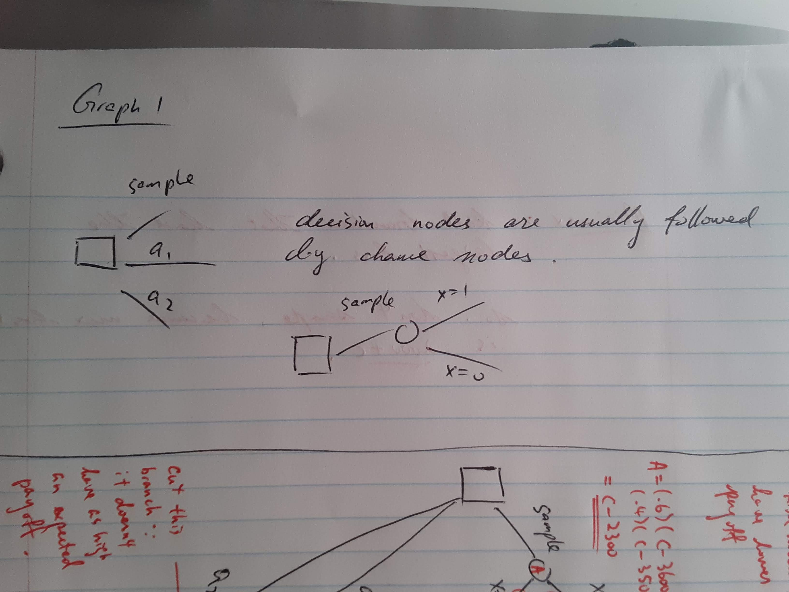
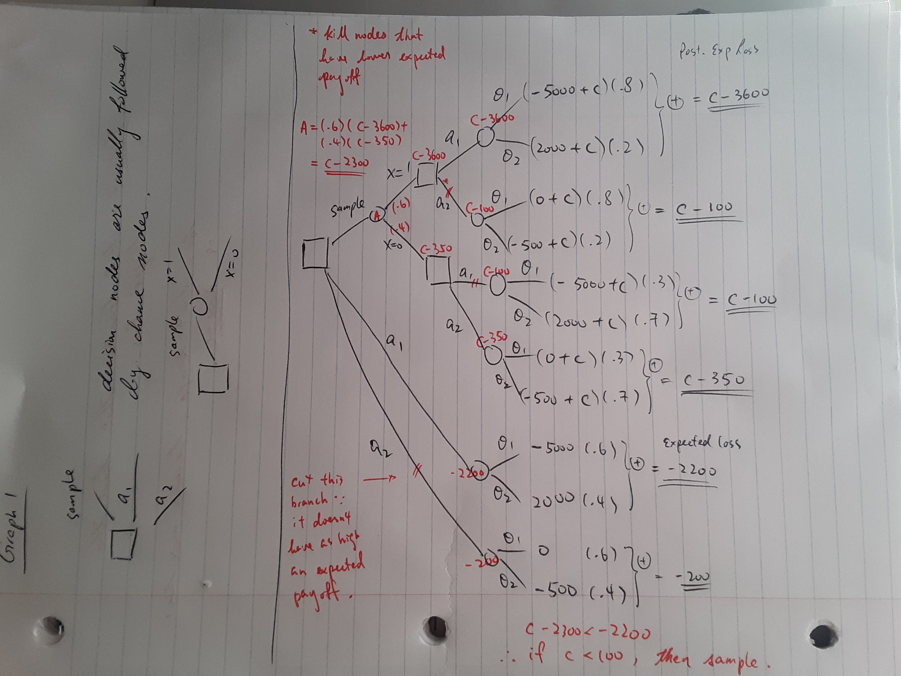
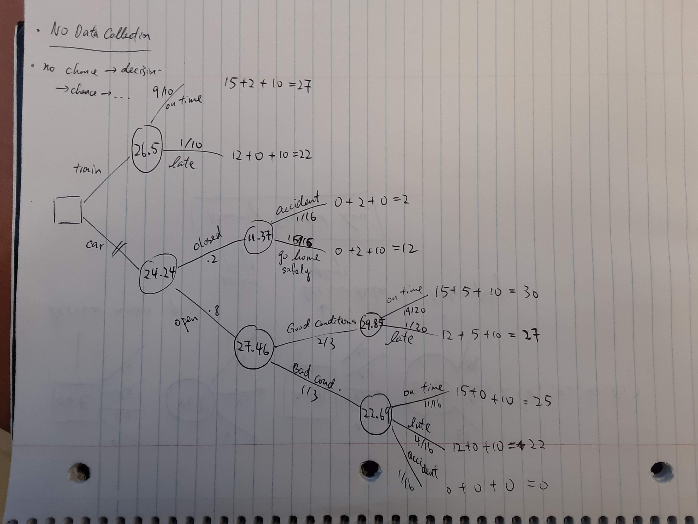
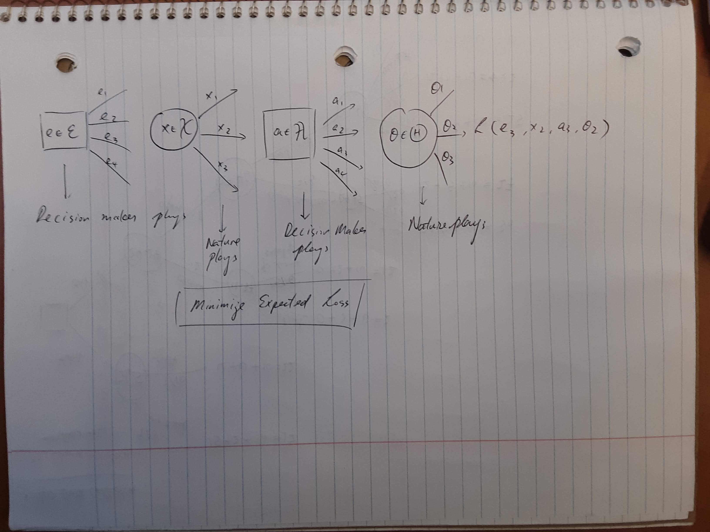

Bayesian Decision Theory - Decision Trees, Coherence & Dynamic Programing
================

Decision Trees
==============

Decision trees provide a pictorial representation of a sequential decision problem (dynamic programming).

Refer to oil drilling example (in `notes01`).

|  \\  |    0|    1|
|------------------------------------------------------------------------------------------------------------------------|----:|----:|
|                                               |   .2|   .8|
|                                               |   .7|   .3|

|  |   (oil)|   (no oil)|
|--------------------------------------------------------------------|--------------------------------------------------------------------------------:|-----------------------------------------------------------------------------------:|
|                                                                    |                                                                               .6|                                                                                  .4|

The outcome 

|  \\  |   (Drill)|   (Sell)|
|------------------------------------------------------------------------------------------------------------------------|----------------------------------------------------------------:|---------------------------------------------------------------:|
|                                               |     |                |
|                                               |        |       |

A decision tree has two types of nodes.

-   `o` chance nodes that depend on random events
-    decision nodes that depend on actions

You start the tree from the root that is placed at the left-hand side of the paper. The decision maker has three choices to start with.

1.  drill
2.  sell
3.  take the sample

&=\Pr(X=1\mid\theta_1) \Pr(\theta_1) + \Pr(X=1\mid\theta_2) \Pr(\theta_2)= (.8)(.6) + (.3)(.4) = .6 \\
\Pr(X=0)&=\Pr(X=0\mid\theta_1) \Pr(\theta_1) + \Pr(X=0\mid\theta_2) \Pr(\theta_2)= .4 \\
\\
\Pr(\theta_1\mid X=1)&=\Pr(X=1\mid\theta_1) \Pr(\theta_1) / \Pr(X=1) = .8\\
\Pr(\theta_2\mid X=0)&=\Pr(X=0\mid\theta_2) \Pr(\theta_2) / \Pr(X=0) = .7\\
\end{split}")

Example 2
---------

Traveller considers crossing a mountain pass in the winter. The traveller can use a car or ride a train. There are uncertainties related to the state of the road and the possibility of an accident.

The decisions are

-    go by car
-    go by train

------------------------------------------------------------------------

-   If traveller takes the train, he will be either late or on time, but he will get there.
-   If traveller goes by car, the pass can be open or closed.
    -   If the pass is closed, he may return safely OR have an accident.
    -   If the pass is open, conditions may be good or bad.
        -   if the conditions are good, he may get to the appointment late or on time
        -   if the conditions are bad, he needs to consider the chances of having an accident

### Probabilities

-    = 4/5")
-    = 2/3")
-    = 1/20")
-    = 1/4")
-    = 1/16")
-    = 1/16")
-    = 1/10")

### Utilities (usually also Negative Losses)

We consider three aspects of the problem. Utilities in parenthesis. .

-   Arrival Time
    -   on time (+15)
    -   late (+12)
    -   no arrival (0)
-   Journey Quality
    -   good (+5)
    -   indifferent (+2)
    -   bad (0)
-   Possibility of Accident
    -   yes (0)
    -   no (+10)

Elements of a Decision Problem
------------------------------

-   **state of nature**: 
-   **actions**:  (aka decisions)
-   **Loss function**: ") (negative utility)
-   **Statistical evidence**  (data)
-   **Experiment**:  ()

The complete scheme looks like:

Bets
----

 is the indicator of an event. Fisher wins a tennis match against Neyman. A bet is a ticket that will be worth  (stakes) if  occurs, and 0 otherwise. The ticket costs .  are the betting odds in favor of . The payoffs for the action of buying a ticket are:

|              |                                                                                   0|                                                                     1|
|--------------------------------------------------------------------------------|-----------------------------------------------------------------------------------:|---------------------------------------------------------------------:|
| Buy bet on   |    S")|  |
| Sell bet on  |  - S")|     |

Dutch Book (Arbitrage)
----------------------

Suppose a bookmaker posts the price  for bets on the event "Fisher wins", and the price  for bets on "Neyman wins". Suppose you place both bets.

|           |                                                        Fisher wins|                                                           Neyman wins|
|-----------|------------------------------------------------------------------:|---------------------------------------------------------------------:|
| Bet 1     |  |  |
| Bet 2     |  |        |
| Both bets |     |        |

You make  **for sure** if you place both bets.

Coherence
---------

A set of betting odds is **coherent** if no combination of bets produces sure losses.

Assumptions:

1.  The odds are fair. The bookmaker is willing to both sell and buy any bets.
2.  There is no restriction in the number of bets that can be placed. And they are all equally valuable.

**Theorem**: Under assumptions 1 and 2 (above), a necessary condition for a set of prices to be coherent is that they satisfy Kolmogorov axioms.

-   Axiom 1: 
-   Axiom 2:  where  is the sure event
-   Axiom 3: If  and  are such that , then 

**Proof**: See Parmigiani & Inoue p.19

Coherent Conditional Probabilities
----------------------------------

See Parmigiani & Inoue p.20 - 21

Utility (Chapter 3)
===================

-   St. Peterburg Paradox
    -   How do we value payoffs that are subject to uncertainty What is the fair price of a bet? The answer to that question is expected utility.
        -   fair value `<->` expected utility
